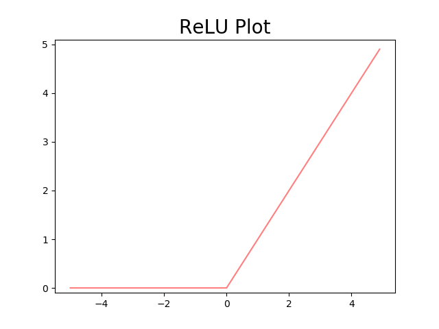

# BottomUpDeepLearing

## Activation Function
#### StepFunctionPlot
```python
def step_function(x):
    y = x > 0
    return y.astype(np.int)
```


#### SigmoidPlot
```python
def sigmoid(x):
    return 1 / (1 + np.exp(-x))
```


#### Both


#### ReLU
```python
def relu(x):
    return np.maximum(0,x)
```
