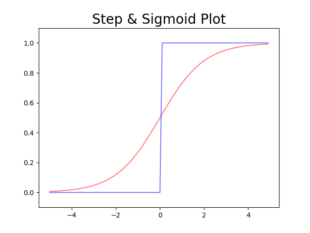

## BottomUpDeepLearing

### Activation Function

StepFunction            |  Sigmoid
:-------------------------:|:-------------------------:
  |  


Both            |  ReLU
:-------------------------:|:-------------------------:
  | 


#### StepFunctionPlot
```python
def step_function(x):
    y = x > 0
    return y.astype(np.int)
```

#### SigmoidPlot
```python
def sigmoid(x):
    return 1 / (1 + np.exp(-x))
```

#### ReLU
```python
def relu(x):
    return np.maximum(0,x)
```
