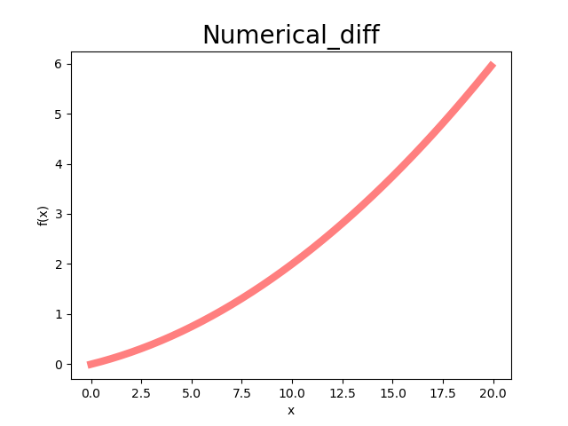
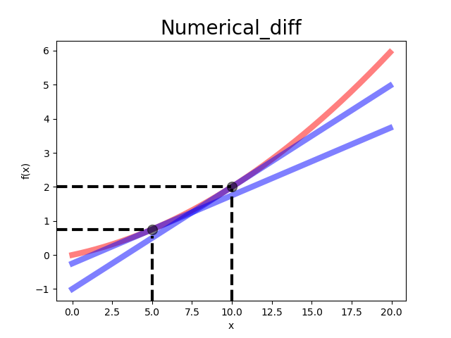

## BottomUpDeepLearing

### LossFunction

#### sum_sqaured_error
```python
def sum_sqaured_error(y,t):
    return 0.5 * np.sum((y-t)**2)
```

#### cross_entropy_error 
```python
def cross_entropy_error(y,t):
    delta = 1e-7
    return -np.sum(t*np.log(y+delta))
```

##### NUMERIC DIFF
Y = 0.01x^2 + 0.1x            |  NUMNERIC DIFF
:-------------------------:|:-------------------------:
  |  